# 🎉 PrintsCharming: The Ultimate Toolkit for Terminal Interfaces, Text Styling, and Advanced Functionality 🎉


## 🚀 Introduction

PrintsCharming is a powerful, self-contained Python library that seamlessly integrates powerful advanced text styling and dynamic terminal interface capabilities into your projects. It provides unmatched flexibility and customizability to create visually appealing terminal outputs that are both functional and engaging. Whether you're looking to enhance readability, streamline debugging, or build interactive terminal applications, PrintsCharming delivers a comprehensive suite of tools to meet your needs. With features like layered styling mechanisms, dynamic text wrapping, interactive components, and advanced box and table printing, it empowers developers to craft polished and professional-grade terminal interfaces effortlessly.

## ✅ Current State

For my current needs, this package does everything I require. It's particularly useful for developers who deal with extensive terminal outputs and need to quickly distinguish between different types of information. It's production-ready and has been rigorously tested in various internal projects.

## 🛠 Future Enhancements

Though **prints_charming** is replete with features tailored for Linux terminals, the fairy tale isn't over, and the door is always open for additional community-driven enhancements. Your contributions could add new chapters to the prints_charming story. 

## 🌟 Key Features
- **No Dependencies**: Entirely self-contained, built using only standard Python libraries. No third-party dependencies required.
- **Efficiency by Design**: Simplifies terminal output styling with intuitive keyword arguments. Spend less time concatenating strings and more time creating polished terminal interfaces.
- **Comprehensive Text Styling**: Supports a wide range of styling options, including foreground and background colors, bold, italic, underline, overline, strikethrough, reverse, and blinking text.
- **Layered Styling Mechanism**: Allows multi-layered and nested styling for terminal text, enabling precise formatting of individual words, phrases, substrings, or whitespace based on dynamic conditions like indices, ranges, or custom rules.
- **Nested Style Application**: Apply styles hierarchically, with outer styles dynamically adjusting to nested styles within the same text for seamless integration.
- **Intelligent Space Styling**: Whitespace between styled words inherits styles from adjacent elements, creating a cohesive appearance without manual intervention.
- **Dynamic Word and Phrase Styling**: Utilize dictionaries with ranges or specific indices to control how words or phrases are styled, allowing flexibility to adjust for runtime conditions.
- **Advanced Word and Substring Detection**: Employs trie-based techniques for efficient detection and styling of phrases, words, or substrings, with customizable precedence and ordering rules.
- **Customizable Progression Styles**: Add progressive styles—such as gradient effects or style variations—across elements like words, spaces, or substrings for visually dynamic outputs.
- **Boundary-Aware Styling**: Smart handling of word and phrase boundaries ensures styles align with logical text breaks, even when spanning multiple nested elements.
- **Dynamic Text Wrapping with ANSI Code Support**: Ensures styled text wraps cleanly within a given width, preserving both visible length and embedded styling codes.
- **Flexible and Customizable**: Leverage predefined styles or define your own for ultimate control over terminal output appearance.
- **Advanced Box and Panel Printing**: Create elegantly bordered boxes and panels with the FrameBuilder for clean and structured output.
- **Sophisticated Table Management**: Build dynamic and interactive tables with TableManager that integrate seamlessly with boxes, frames, and other UI components.
- **Layered Box and Table Integration**: Nested tables, frames, and panels are supported, making it possible to create highly organized, multi-layered layouts for terminal applications.
- **Bound Cell Support**: Dynamically update cell content within tables, enabling real-time interactive elements.
- **Nested Tables and Frames**: Support for creating complex layouts with nested tables and frames, enhancing readability and organization.
- **Logging and Exception Handling**: Includes integrated tools for logging and exception handling to streamline debugging and output tracking.
- **Integrated Multi-Level Debugging**: Provides detailed debugging for nested or layered styling, with logs to inspect how and why specific styles were applied.
- **Mouse and Keyboard Input Handling**: Supports real-time interaction with mouse events, escape sequences, and keystrokes, enabling interactive terminal applications.
- **Interactive Components**: Use interactive features like menus and tools to create engaging terminal-based programs.
- **Intelligent Defaults**: Comes with sensible defaults but allows you to tweak every aspect to your liking.
- **Built for Linux**: "Designed and optimized for Linux terminals, with additional support for legacy Windows command prompts (via autoconf_win) and modern Windows terminals out of the box.


## Example Applications:

- **Calculator UI**: An interactive calculator with a dynamic display and clickable buttons, showcasing real-time input handling and UI updates.

- **Snake Game**: A classic Snake game implementation demonstrating the use of dynamic content, real-time rendering, and keyboard input handling in the terminal.

## Interactive Customizations

To take customization even further, prints_charming includes an interactive color_map creation wizard, allowing you to define and name your own custom colors. Simply run python -m prints_charming.colors_wizard to launch the wizard and generate a personalized color_map that you can use throughout your project for seamless, consistent styling. styles_wizard coming soon.

## 🚀 Quick Start

To get started, install the package and add it to your project.

### Option 1: Using pip

```bash
pip install prints_charming
```

### Option 2: Cloning from GitHub

Alternatively, you can clone the repository directly from GitHub to access the latest features and updates that might not yet be published on PyPI:

1. Open a terminal window.

2. Navigate to the directory where you want to clone the repository.

3. Run the following command to clone the repository:

```bash
git clone https://github.com/deefifofun/prints_charming.git
```

4. Navigate into the cloned directory:

```bash
cd prints_charming
```

5. Install the package using:

```bash
pip install .
```

This will install the package from the source code.


### Here are examples of the basics. Please check out main.py in the examples folder for more. Will be updated soon. 

### Some random screenshots

### Calculator UI example supports keypresses too
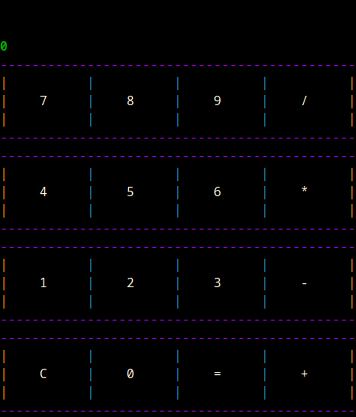

### Interactive Menu
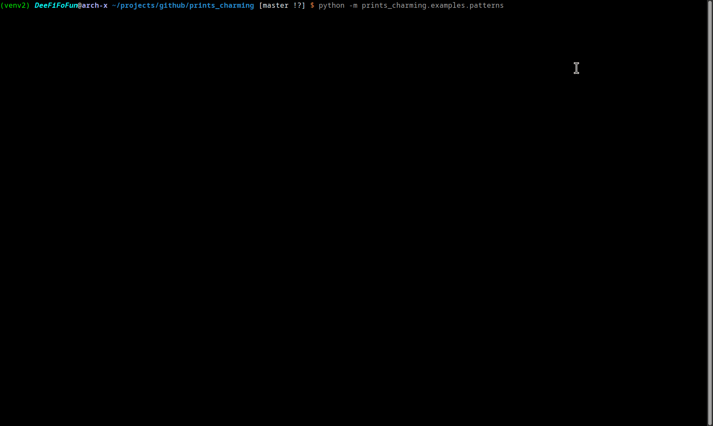

### Nested tables from TableManager nested in FrameBuilder frame
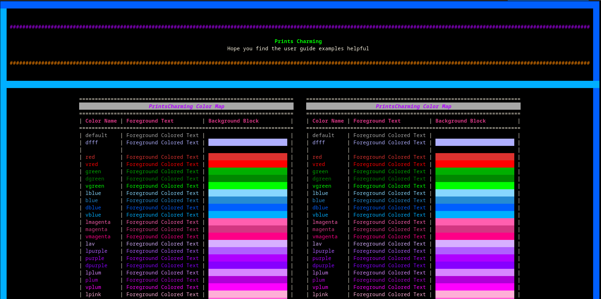

### More tables and frames
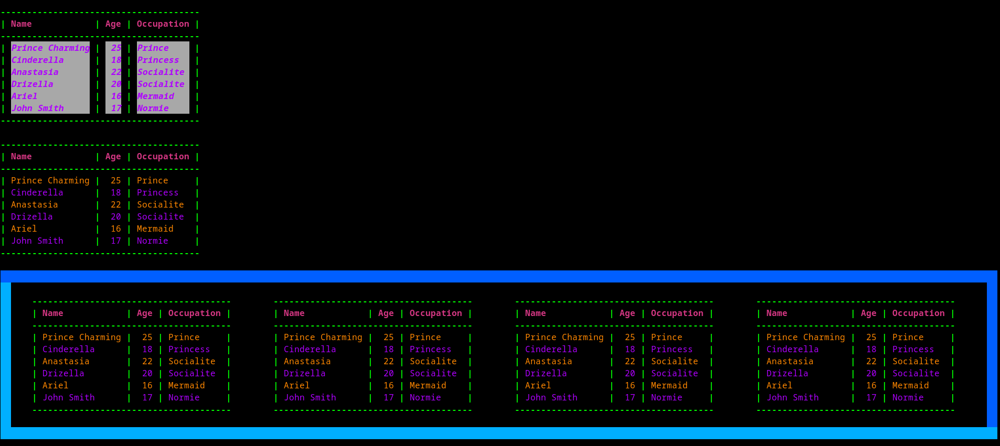

### Patterns...Low fps gif prob not the best way to show this, but run it yourself in examples subpackage.
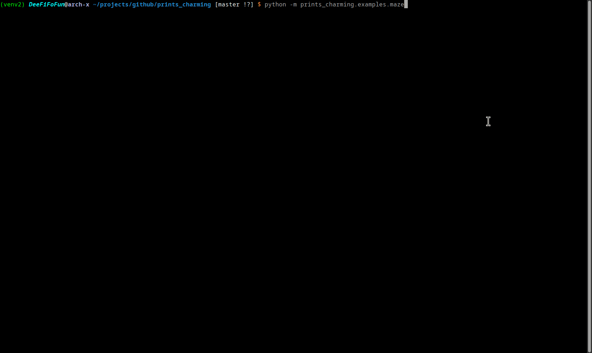

### More tables showing more dynamic styling
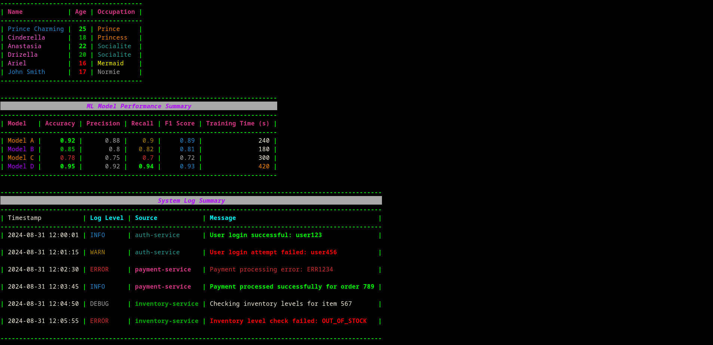

### More nested tables in frames showing different alignments
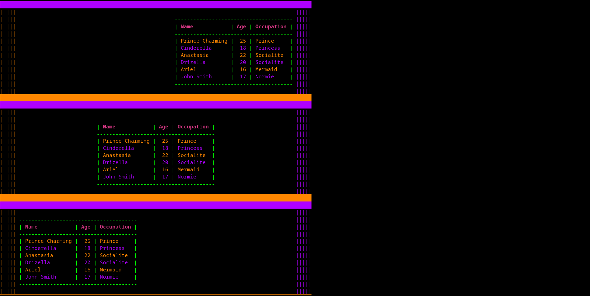

### Frame Builder cols
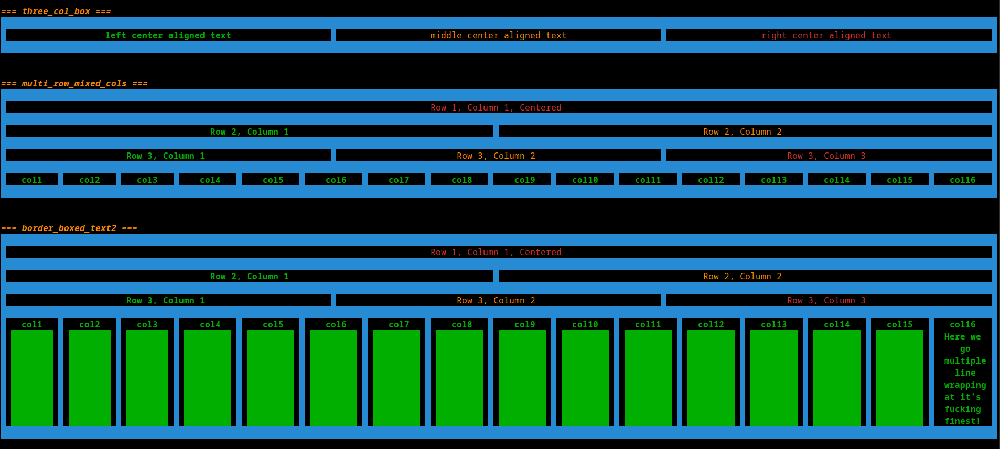

### Showing multi column frames wrapping text
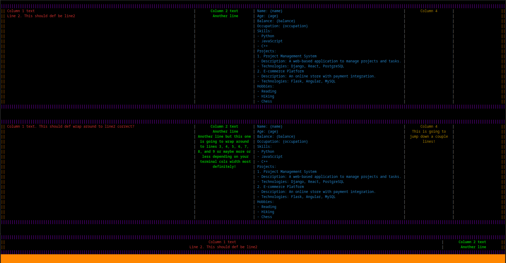

### Screenshot from the code snippet below... 
create_logger_with_its_own_default_pc_instance()
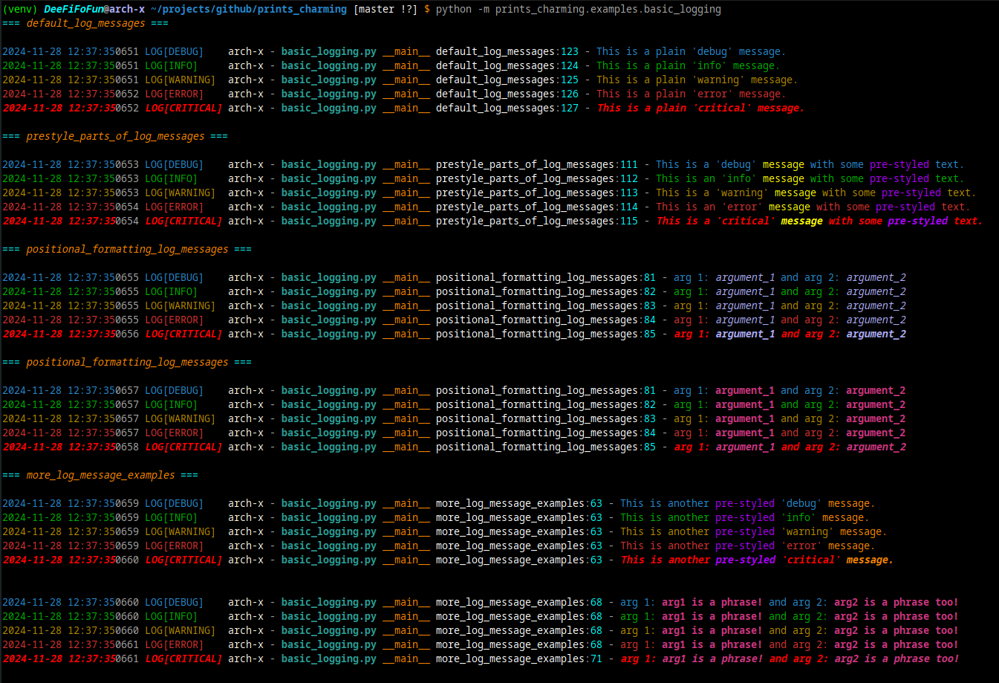

### Screenshot from the code snippet below... 
create_logger_with_specific_pc_instance()
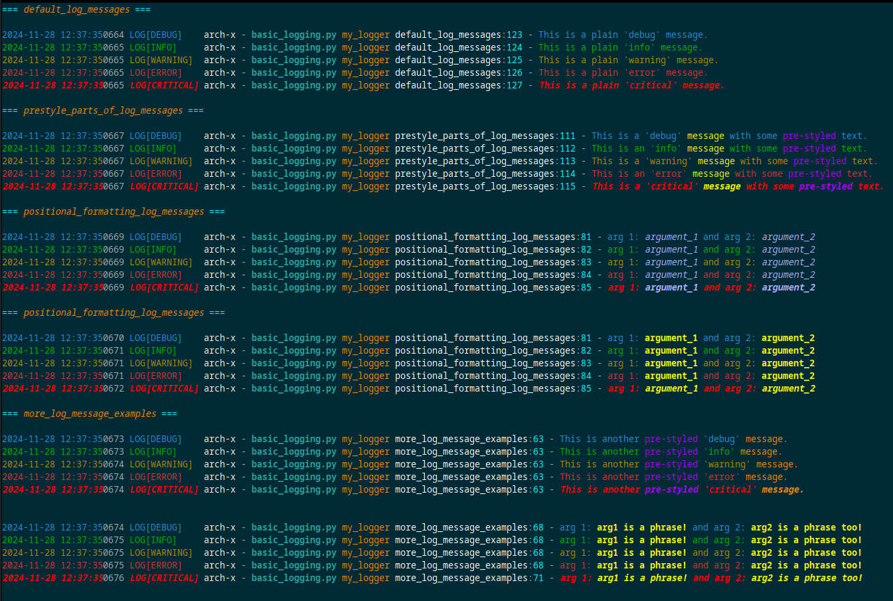

### Markdown
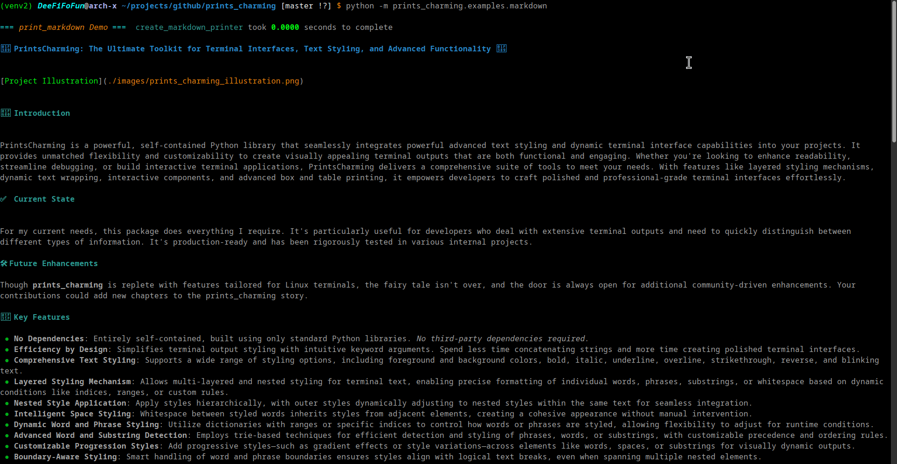

### Basic Snake Game
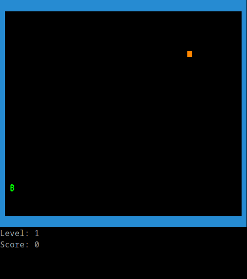

### Look through the examples subpackage for various implementations 


## 📧 Contact
For bugs, feature requests, and suggestions, please open an issue on GitHub.


